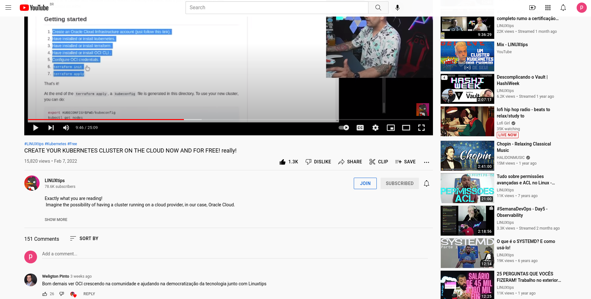

Tecnologia em Análise e Desenvolvimento de Sistemas

Setor de Educação Profissional e Tecnológica - SEPT

Universidade Federal do Paraná - UFPR

---

*DS122 - Desenvolvimento de Aplicações Web 1*

Prof. Alexander Robert Kutzke

**[Instruções para submissão de tarefas e trabalhos](https://gitlab.com/ds122-alexkutzke/material/-/blob/main/instrucoes_submissao_tarefas_e_trabalhos.md);

** [Video aula com exemplo de submissão](https://www.youtube.com/watch?v=d6ZTnQNhoCo)

# Atividade: Clone Youtube

Crie uma página que simule conteúdo e layout de uma visualização de um video do YouTube (exemplo na figura abaixo). Nesse caso, sua página deve:

- Tocar um video do youtube;
- Simular presença de descrição do vídeo e comentários fictícios;
- Links para outros vídeos;
- Possuir um arquivo CSS para estilos da página de forma que se aproxime o máximo possível com a aparência atual de uma página de vídeo do Youtube.

Você pode utilizar o inspetor do navegador para descobrir detalhes da página original do Youtube.

**A página do Youtube é bastante complexa**. Por isso, escolha apenas alguns detalhes para copiar. **Não se preocupe em fazer um clone perfeito**.

Reforçando, todo conteúdo pode ser fictício.

